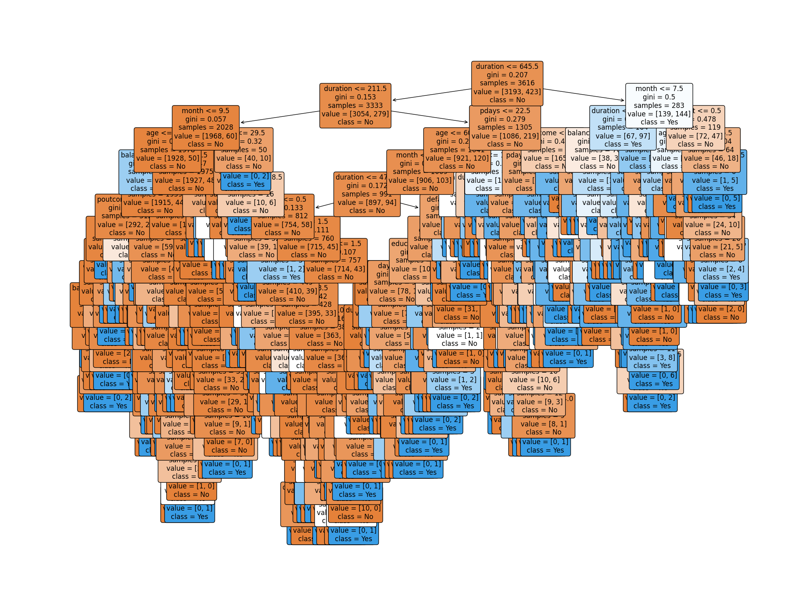

# Data Science Task 03: Customer Purchase Prediction with Decision Tree

## Overview
In this project, I built a Decision Tree Classifier to predict whether a customer will purchase a product or service based on their demographic and behavioral data. The analysis uses the **UCI Bank Marketing dataset**, which contains information about various customer characteristics and their interactions with marketing campaigns.

The dataset is publicly available from the UCI Machine Learning Repository:

- Dataset: [Bank Marketing Dataset](https://archive.ics.uci.edu/ml/datasets/Bank+Marketing)

## Objective
The objective of this project is to:
- Load the Bank Marketing dataset.
- Preprocess the data, including encoding categorical variables and handling missing values.
- Train a Decision Tree Classifier on the data.
- Evaluate the performance of the model by calculating accuracy and generating a classification report.
- Visualize the trained decision tree and save it as an image.

## Steps to Execute
1. **Clone the Repository**:  
   Clone this repository to your local machine using the following command:
   ```bash
   git clone https://github.com/Shreyabagal/PRODIGY_DS_03.git
   ```

2. **Install Dependencies**:  
   Install the required Python libraries using `pip`. You can install them from the `requirements.txt` file:
   ```bash
   pip install -r requirements.txt
   ```

3. **Run the Script**:  
   Run the Python script to train the model and generate the decision tree visualization:
   ```bash
   python bank_marketing_decision_tree.py
   ```

4. **Output**:  
   After running the script, the following outputs will be generated:
   - The decision tree plot will be saved as `decision_tree_plot.png` in the `Image/` directory.
   - The classification results (accuracy and classification report) will be displayed in the terminal.

## Visualizations

Below is the decision tree visualization for predicting customer purchases:



## Explanation of the Code
The Python script (`bank_marketing_decision_tree.py`) performs the following steps:
1. **Data Loading**: The script loads the Bank Marketing dataset from a CSV file (make sure to place the `bank.csv` file in the same directory).
2. **Data Preprocessing**: It encodes categorical columns using `LabelEncoder` and handles any missing values by replacing them with the median of the respective columns.
3. **Model Training**: A `DecisionTreeClassifier` is initialized and trained on the dataset to predict whether a customer will subscribe to a product or service.
4. **Evaluation**: The model’s performance is evaluated using accuracy and a classification report, which are printed in the terminal.
5. **Visualization**: The trained decision tree is visualized using `matplotlib` and `plot_tree` from `sklearn`. The plot is saved as `decision_tree_plot.png` in the `Image/` directory.

## Technologies Used
- Python
- Pandas
- Scikit-learn
- Matplotlib

## File Structure
```
PRODIGY_DS_03/
├── bank_marketing_decision_tree.py  # Python script for training and visualizing the decision tree
├── requirements.txt                 # Python dependencies
├── Images/
│   └── decision_tree_plot.png       # Saved decision tree plot image
├── bank.csv                         # Bank marketing dataset (make sure to download it from UCI)
├── README.md                        # Project documentation
```

---

